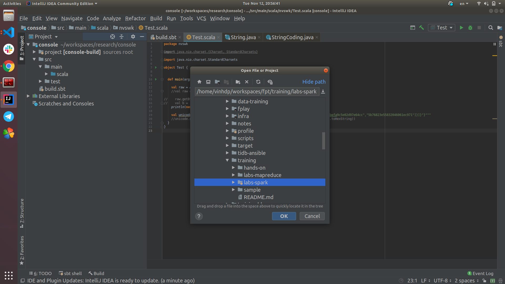
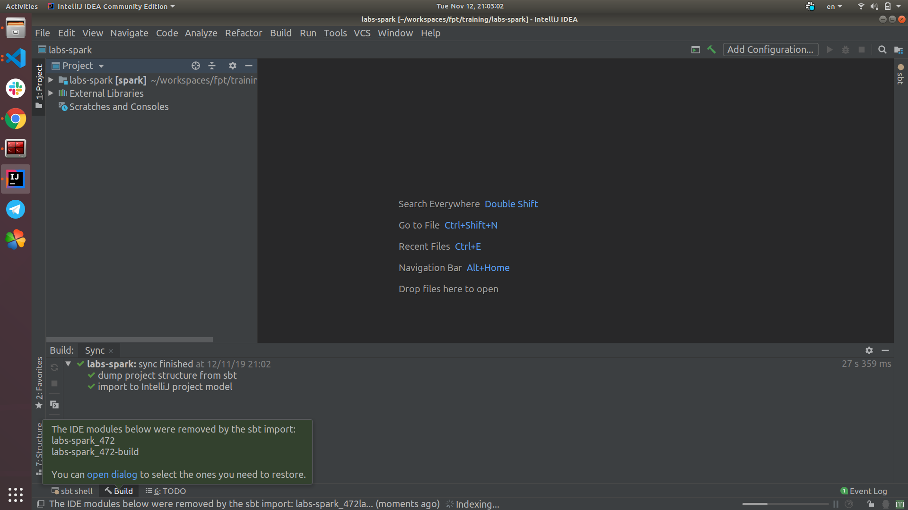

# Scala Quickstart Tutorial

For detail scala instruction, please follow [Tour Of Scala](https://docs.scala-lang.org/tutorials/tour/tour-of-scala.html.html)

## Scala HelloWorld

### Prerequsities

- [Java](https://github.com/vinhdangphuc/hands-on/blob/master/hands-on/java.md)
- [Sbt](https://github.com/vinhdangphuc/hands-on/blob/master/hands-on/sbt.md)

### Step #01: Clone project from github

```
git clone https://github.com/vinhdangphuc/hands-on.git
```

### Step #02: Import project labs-spark

On your favourite IDE, import project under labs-spark. Incase of Intellij IDEA, select File -> Open -> Browse for labs-spark



After project initialized successfully, you will see this message on your IDE



### Step #03: Write the first HelloWorld using Scala

- Create new `HelloWorld.scala` in package `vn.fpt.scalaz` under src/main/scala/

- Add the following file content

```
package vn.fpt.scalaz

object HelloWorld {

  def main(args: Array[String]): Unit = {

    println("Hello World")
  }
}
```

Running in command line

```
cd $PROJECT

sbt "runMain vn.fpt.scalaz.HelloWorld"
```

Output should be

```
[info] Loading settings for project global-plugins from metals.sbt ...
[info] Loading global plugins from /home/vinhdp/.sbt/1.0/plugins
[info] Loading settings for project labs-spark-build from plugins.sbt ...
...
[info] running vn.fpt.scalaz.HelloWorld 
Hello World
[success] Total time: 2 s, completed Nov 12, 2019 9:20:47 PM

```

## Exercise #01 (15 mins):

Write wordcount program using Scala

## Bonus Exercise #02 (15 mins):

If you have successfully finished Excerise #01, feel free to continue with Ex02.

Provide users information (../sample/stackoverflow_users.csv) with schema below

```
_Id: long
_CreationDate: String
_DisplayName: String
_LastAccessDate: String
_Reputation: long
_UpVotes: long
_Views: long
```

We need to know how many new register users every day?

Write a scala program that calculate new register users and sort the final output by date, print result directly in console

## Bonus Exercise #03: Implicit Conversions

We want to convert a date string in format yyyy-MM-dd HH:mm:ss into unix long but we don't want to write any helper utility like

```
Utils.toEpochSecond("2019-11-12 23:00:00")
```

Write a simple program using scala Implicit Conversions like this

```
"2019-11-12 23:00:00".toEpochSecond
```

## Bonus Exercise #04: Pattern Matching

Giving the following log:

```
109.169.248.247 - - [12/Dec/2015:18:25:11 +0100] "GET /administrator/ HTTP/1.1" 200 4263 "-" "Mozilla/5.0 (Windows NT 6.0; rv:34.0) Gecko/20100101 Firefox/34.0" "-"
109.169.248.247 - - [12/Dec/2015:18:25:11 +0100] "POST /administrator/index.php HTTP/1.1" 200 4494 "http://almhuette-raith.at/administrator/" "Mozilla/5.0 (Windows NT 6.0; rv:34.0) Gecko/20100101 Firefox/34.0" "-"
191.182.199.16 - - [12/Dec/2015:19:02:35 +0100] "GET /modules/mod_bowslideshow/tmpl/css/bowslideshow.css HTTP/1.1" 200 1725 "http://almhuette-raith.at/" "Mozilla/5.0 (Windows NT 6.1; WOW64) AppleWebKit/537.36 (KHTML, like Gecko)
46.116.249.142 - - [12/Dec/2015:19:28:28 +0100] "POST /administrator/index.php HTTP/1.1" 200 4494 "http://almhuette-raith.at/administrator/" "Mozilla/5.0 (Windows NT 6.0; rv:34.0) Gecko/20100101 Firefox/34.0" "-"
46.116.249.142 - - [12/Dec/2015:19:28:28 +0100] "PUT /administrator/index.php HTTP/1.1" 200 4494 "http://almhuette-raith.at/administrator/" "Mozilla/5.0 (Windows NT 6.0; rv:34.0) Gecko/20100101 Firefox/34.0" "-"

```

Write simple program extract the following information:

- Ip
- Datetime
- Request method
- Request URL